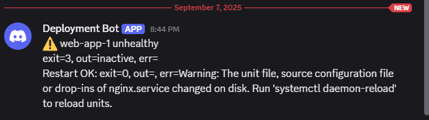

#  Python Remote Infra Orchestrator

A lightweight CLI tool to **monitor remote servers**, run health checks, restart services if needed, and send **Discord notifications**.

---

## 🚀 Features
- Configurable via **YAML, YML, or JSON**
- Health checks:
  - `http`: call an HTTP endpoint
  - `remote_cmd`: run a command over SSH
- Passwordless SSH (EC2 style with `.pem` key)
- Restarts services via `systemctl`
- Logs to both file & console
- Discord notifications

---


## ⚡ Setup

### Prerequisites
- Python 3.8 or higher
- `pip` package manager
- SSH access to target servers
- Discord webhook URL

### Installation
1. Clone the repository: `git clone https://github.com/linckon/infra-orchestrator.git`
2. Navigate to the project directory: `cd infra-orchestrator`
3. Create a virtual environment: 
    `python3 -m venv venv`
    `source venv/bin/activate`

4. Install dependencies: `pip install -r requirements.txt`
 

### Run
  `python orchestrator.py --config config.yaml`


### Log
Logs are stored in both file and console for debugging and monitoring purposes.

```bash
python3 orchestrator.py --config config.json
2025-09-07 20:43:44 | INFO | [web-app-1] Checking health...
2025-09-07 20:43:44 | INFO | Connected (version 2.0, client OpenSSH_9.6p1)
2025-09-07 20:43:44 | INFO | Authentication (publickey) successful!
2025-09-07 20:43:45 | INFO | [web-app-1] Healthy: exit=0, out=active, err=
> python3 orchestrator.py --config config.json
2025-09-07 20:44:43 | INFO | [web-app-1] Checking health...
2025-09-07 20:44:43 | INFO | Connected (version 2.0, client OpenSSH_9.6p1)
2025-09-07 20:44:44 | INFO | Authentication (publickey) successful!
2025-09-07 20:44:44 | WARNING | [web-app-1] Unhealthy: exit=3, out=inactive, err=
2025-09-07 20:44:44 | INFO | Connected (version 2.0, client OpenSSH_9.6p1)
2025-09-07 20:44:44 | INFO | Authentication (publickey) successful!
2025-09-07 20:44:45 | INFO | [web-app-1] Restart OK: exit=0, out=, err=Warning: The unit file, source configuration file or drop-ins of nginx.service changed on disk. Run 'systemctl daemon-reload' to reload units.
2025-09-07 20:44:46 | INFO | Notification sent to Discord.
```

### Discord Notification




